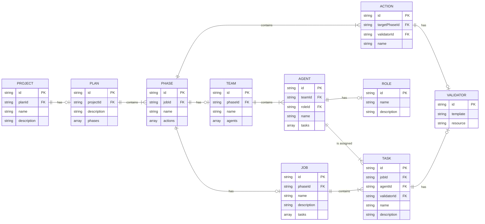

# puzzlemaster

An MCP client that allows teams of agents to complete long-horizon tasks.

- Uses the [puzzlebox MCP server](https://github.com/cliffhall/puzzlebox) for agent coordination.
- Built with Electron, React, and TypeScript

## Project Setup

### Install

```bash
$ npm install
```

### Development

```bash
$ npm run dev
```

### Test

```bash
$ npm run test
```

### Build

```bash
# For windows
$ npm run build:win

# For macOS
$ npm run build:mac

# For Linux
$ npm run build:linux
```

## Domain Model

### Entities

[**Action**](src/shared/domain/Action.ts) |
[**Agent**](src/shared/domain/Agent.ts) |
[**Job**](src/shared/domain/Job.ts) |
[**Phase**](src/shared/domain/Phase.ts) |
[**Plan**](src/shared/domain/Plan.ts) |
[**Project**](src/shared/domain/Project.ts) |
[**Role**](src/shared/domain/Role.ts) |
[**Task**](src/shared/domain/Task.ts) |
[**Team**](src/shared/domain/Team.ts) |
[**Validator**](src/shared/domain/Validator.ts) |
[DomainError](src/shared/domain/DomainError.ts)

### Entity Relationships

* [In Mermaid Editor](https://www.mermaidchart.com/app/projects/c1568af3-b180-46e6-bd34-bee129ef3c3d/diagrams/d3cd4cd7-81b3-4c28-8a38-e4158f0ea532/version/v0.1/edit)


